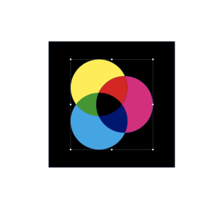
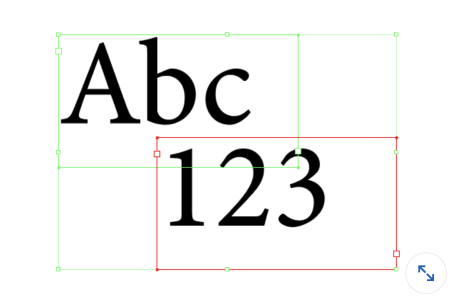
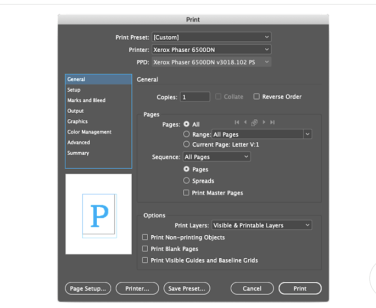

## Adobe InDesign

#### P1. ¿Cuál es una de las razones para hacer clic en Opciones de objeto > marco de texto?

- \[x] para cambiar el número de columnas de un marco de texto
- \[ ] para aplicar una sombra paralela al fotograma
- \[ ] para cambiar las esquinas de un marco de esquina a redondeado
- \[ ] para cambiar el relleno y el trazo de un marco de texto

[Ref.](https://www.agitraining.com/adobe/indesign/tutorials/text-frame-options-in-indesign?page=4#:~:text=You%20can%20have%20InDesign%20determine,choosing%20Object%20%3E%20Text%20Frame%20Options.)

#### P2. ¿Qué panel le permite agregar una punta de flecha al final de una línea?

- \[ ] Efectos
- \[x] Trazo
- \[ ] Transformar
- \[ ] Conquistador

[Ref.](https://helpx.adobe.com/in/indesign/using/applying-line-stroke-settings.html#:~:text=Use%20the%20Start%20and%20End,the%20Start%20and%20End%20menus.)

#### P3. En la imagen que se muestra, ¿qué sabes sobre el estilo de párrafo Body Text?

- \[x] El texto seleccionado no se formateó con la definición de estilo.
- \[ ] El texto seleccionado está en texto desbordado fuera de los límites del marco actual.
- \[ ] El estilo se ha aplicado a dos o más párrafos.
- \[ ] El estilo se ha agregado desde que se crearon los estilos maestros.

[Ref.](https://helpx.adobe.com/indesign/using/paragraph-character-styles.html)

#### P4. Desea asegurarse de que una imagen en su página sea exactamente el 25% de su tamaño original. ¿Cómo puede determinar si la imagen está configurada en el tamaño deseado?

- \[x] Haga doble clic en la imagen con la herramienta Selección.
- \[ ] Seleccione el marco gráfico con la herramienta Selección.
- \[ ] Haga clic en **Ventana** > **Información**.
- \[ ] Haga clic en **Objeto** > **Idóneo**.

#### P5. Tiene un documento de InDesign de una página vacío. Ha utilizado File > Place para seleccionar un documento de Word que contiene muchas páginas de texto. ¿Qué te ayudará a colocar la historia completa rápidamente?

- \[ ] Seleccionar **Mostrar opciones de importación** En **Lugar** cuadro de diálogo.
- \[ ] Haga clic con el botón derecho en la página con el cursor de posición.
- \[x] Pulse Mayús y haga clic con el cursor dentro de las guías de margen.
- \[ ] En el **Páginas** , haga clic en el icono **Nuevas páginas** con el cursor de posición.

#### P6. Seleccione un marco gráfico que contenga una imagen de Photoshop y utilice el campo Escala del panel de control para ampliarlo al 200 %. ¿Qué sucede con la resolución efectiva de la imagen?

- \[ ] La resolución se duplica.
- \[ ] La resolución efectiva de la imagen sigue siendo la misma hasta que elija en el menú Ver > Rendimiento de la pantalla.
- \[ ] La resolución efectiva de la imagen se establece en Photoshop, no en InDesign, por lo que sigue siendo la misma.
- \[x] Correcto La resolución se reduce a la mitad.

#### P7. ¿Cuál es una de las razones por las que es posible que desee utilizar la función Variables de texto?

- \[ ] para crear subtítulos debajo de las imágenes que se actualizan automáticamente
- \[ ] para incluir cálculos dentro de una tabla dinámica
- \[ ] para ajustar el tamaño del texto automáticamente para rellenar el marco
- \[x] para crear encabezados en ejecución que incluyan nombres de capítulo

#### P8. Desea colocar 4 de un PDF de varias páginas en un documento de InDesign. ¿Qué debes hacer?

- \[x] En el **Lugar** cuadro de diálogo, seleccione **Mostrar opciones de importación**.
- \[ ] Importar el PDF con el **Medio** panel en lugar de **Archivo>Lugar**
- \[ ] Abra el PDF en Acrobat, seleccione la página 4 y arrástrelo a InDesign.
- \[ ] Después de colocar el PDF, deshabilite las páginas no deseadas en el panel Medios.

#### P9. Supongamos que la página maestra B se basa en la página maestra A y que actualmente está editando la página maestra B. ¿Qué afirmación es cierta?

- \[ ] Los objetos de la página maestra A no son visibles.
- \[ ] Los objetos de la página maestra A siempre deben aparecer detrás de los objetos de la página maestra B.
- \[x] Los objetos de la página maestra A no se pueden seleccionar a menos que se invaliden los objetos.
- \[ ] Los objetos de la página maestra A no se pueden seleccionar ni cambiar.

#### P10. En la imagen que se muestra, el texto está en una ruta. Desea mover el texto más a la derecha a lo largo del trazado. ¿Cómo puedes lograr esto?

- \[ ] Arrastre el cuadrado azul D.
- \[ ] Arrastre el mango lateral B
- \[x] Arrastre la línea inclinada A.
- \[ ] Arrastre la marca de verificación central C.

#### P11. Al seleccionar un marco rectangular en la página, InDesign muestra un cuadrado amarillo cerca de la esquina superior derecha del marco. ¿Qué te permite hacer esto?

- \[x] Cambie las esquinas de cuadradas a redondeadas.
- \[ ] Ancla el objeto en otro marco.
- \[ ] Cambie la capa o el orden z del marco.
- \[ ] Vincular el marco a otro marco.

#### P12. ¿Qué acción puede realizar la herramienta Pluma en un objeto seleccionado?

- \[ ] La herramienta Pluma no puede afectar a un objeto después de que se haya creado.
- \[ ] Puede hacer clic en un punto para convertirlo en una curva.
- \[ ] Puede arrastrar la herramienta Pluma dentro de un marco para convertirlo en una forma compuesta.
- \[x] Puede hacer clic en un punto para eliminarlo.

#### P13. ¿Cuál es una de las razones por las que es posible que desee utilizar la función Span Columns?

- \[x] Tiene una lista de viñetas de seis elementos que desea dividir en dos columnas en el medio de un marco de texto.
- \[ ] Está cambiando el número de columnas en una página y desea asegurarse de que el texto fluya correctamente.
- \[ ] Desea que una línea o borde sombreado superior se extienda a través de la parte superior de un marco de varias columnas.
- \[ ] Tiene un encabezado que desea abarcar en dos marcos de texto enlazados

#### P14. ¿Qué afirmación sobre las tablas es cierta?

- \[ ] Las tablas siempre están ancladas en una historia en un marco de texto.
- \[ ] Para editar el texto de una tabla, primero debe hacer clic en **Tabla>Convertir tabla en texto**
- \[ ] Las tablas deben contener más de una celda.
- \[ ] Las tablas no se pueden anclar en un artículo en un marco de texto

#### P15. ¿Qué característica usaría para crear el efecto que se muestra, donde los círculos agrupados se mezclan entre sí pero no el objeto detrás de ellos?

- \[ ] Luz Global
- \[ ] el modo de fusión de pantalla
- \[ ] Mezcla aislada
- \[ ] Grupo Eliminatorio

#### P16. En la imagen que se muestra, ¿qué indican los bordes de marco de color?

- \[ ] en qué capa se encuentra cada objeto
- \[ ] en qué página maestra se encuentra cada objeto
- \[ ] qué estilo de objeto se aplica al marco
- \[ ] que el marco rojo está bloqueado

#### P17. Para cambiar el tamaño de cualquier marco y su contenido y mantener las proporciones de ambos, ¿qué tecla o teclas debe presionar mientras arrastra desde un controlador de esquina?

- \[ ] Ctrl (Windows) o Comando (Mac)
- \[ ] Alt+Mayús (Windows) u Opción+Mayús (Mac)
- \[ ] Ctrl+Mayús (Windows) o Comando+Mayús (Mac)
- \[ ] Alt+Barra espaciadora (Windows) u Opciones+Barra espaciadora (Mac)

#### P18. En la imagen mostrada, ¿qué se puede inferir sobre cómo se imprimirá este documento?

- \[ ] La página se escalará para que se ajuste al papel.
- \[ ] Todas las capas de documento serán visibles
- \[ ] Parte de la página de InDesign se recortará.
- \[ ] La página maestra P se aplica a las páginas del documento.

#### P19. Después de hacer clic en un color en el cuadro **Gradiente** para seleccionarlo, ¿cómo puede establecer su color en una muestra en el cuadro **Muestras** ¿tablero?

- \[ ] Haga doble clic en la muestra.
- \[ ] Opción y haga clic (Mac) o Alt y haga clic (Windows) en la muestra.
- \[ ] No se puede aplicar una muestra de color a un tope de color en el **Gradiente** tablero.
- \[ ] Arrastre el tope de color sobre el color en el cuadro **Muestras** tablero.
