## Adobe Premiere Pro

#### D1. Aprite una sequenza nidificata per tagliare la lunghezza di una clip. La durata totale delle clip viene allungata. Cosa succede alla durata del nido nella sequenza principale?

- \[x] Niente, la durata del nido rimane la stessa nella sequenza originale.
- \[ ] La durata del nido cambia e una modifica di sovrascrittura spinge le clip rimanenti a fare spazio.
- \[ ] Le clip cambiano velocità in base alla durata del nido.
- \[ ] La durata del nido cambia e una modifica dell'ondulazione spinge le clip rimanenti a fare spazio.

#### D2. Qual è un buon motivo per utilizzare una sequenza nidificata?

- \[ ] Il nesting migliora le prestazioni di riproduzione.
- \[ ] Il nesting semplifica la riduzione del disordine nel pannello Progetto, risparmiando tempo e potenzialmente il budget del progetto.
- \[x] La nidificazione consente di applicare un singolo effetto a tutto ciò che si trova all'interno del nido, come una correzione del colore o un limitatore video.
- \[ ] Il nesting aiuta Adobe Premiere Pro a eseguire il rendering più velocemente.

#### D3. Cosa succede sul disco rigido quando si crea una clip secondaria?

- \[x] Niente, poiché una clip secondaria non crea un nuovo file multimediale sul disco rigido.
- \[ ] Viene creato un file puntatore sul disco rigido.
- \[ ] Una nuova clip master viene creata sul disco rigido e aggiunta al progetto.
- \[ ] Viene creato un nuovo file multimediale accanto al supporto originale.

#### D4. Quale affermazione è _falso_ per quanto riguarda l'esportazione di file multimediali da Adobe Premiere Pro?

- \[ ] Adobe Premiere può esportare direttamente i file.
- \[ ] Potete codificare sequenze in uno o più formati con Adobe Media Encoder.
- \[ ] Durante l'utilizzo di Adobe Media Encoder, potete continuare a lavorare sulla stessa sequenza in Adobe Premiere Pro.
- \[x] Quando fate clic su Esporta, Adobe Premiere Pro codifica il file in background e vi consente di continuare la modifica.

#### D5. Mentre lavorate in Premiere Pro, come potete creare rapidamente una nuova composizione di After Effects con impostazioni che corrispondono alla sequenza corrente?

- \[ ] Selezionate File > Adobe Dynamic Link > Importa after Effects Composition.
- \[ ] Importate un progetto da After Effects e scegliete Abbina dimensione progetto durante l'importazione.
- \[x] Selezionate File > Adobe Dynamic Link > nuova composizione after effects.
- \[ ] Passate ad After Effects e impostate manualmente il progetto per verificarne la precisione.

#### D6. Quale NON è un tag disponibile nel pannello Suono essenziale?

- \[x] Narrazione
- \[ ] SFX
- \[ ] Ambiente
- \[ ] Musica

#### D7. La correzione del colore secondaria HSL consente di regolare quale delle seguenti opzioni? Selezionare tre elementi.

```markdown
A. Clarity
B. Contrast
C. Saturation
D. Temperature
E. Blur
```

- \[x] B, C, D
- \[ ] A, B, C
- \[ ] B, D, E
- \[ ] A, C, E

#### D8. Qual è l'unico pannello in cui lo strumento Rate Stretch può modificare una clip?

- \[ ] Pannello Program Monitor
- \[ ] Pannello Monitor sorgente
- \[x] Pannello Timeline
- \[ ] Pannello Browser multimediale

#### D9. Cosa potete fare per fare in modo che il livello forma regoli automaticamente le dimensioni al variare del livello testo?

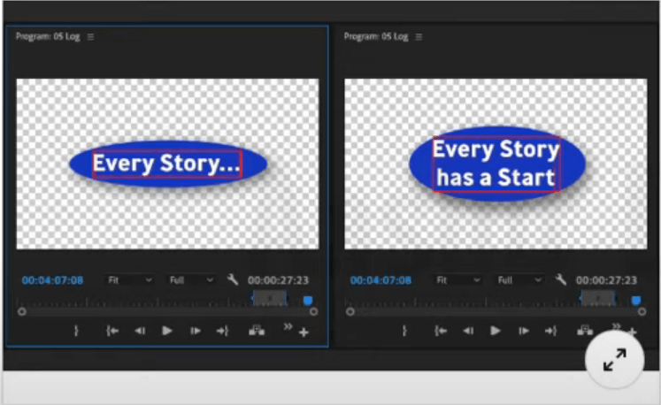

- \[x] Selezionare l'opzione Maschera con forma.
- \[ ] Selezionare Responsive Design e Aggiungi al livello testo.
- \[ ] Selezionare Responsive Design e Aggiungi al fotogramma video.
- \[ ] Utilizzare i controlli Allinea e Trasforma.

#### D10. In quale pannello assemblate i media per creare una sequenza?

- \[ ] Pannello Timeline
- \[ ] Pannello Browser multimediale
- \[ ] Pannello cattura
- \[x] Pannello Monitor sorgente

#### D11. Quale pannello consente di modificare gli effetti video dopo che sono stati applicati a una clip?

- \[x] Pannello Effetti
- \[ ] Pannello Timeline
- \[ ] Pannello Monitor sorgente
- \[ ] Pannello Controllo effetti

#### D12. Supponiamo che le clip si colleghino a file multimediali memorizzati in più posizioni. Si desidera avere i file multimediali in un'unica posizione nel loro formato corrente. Quale opzione scegliere nel Project Manager?

- \[ ] Escludi clip inutilizzate
- \[ ] Consolida e transcodifica
- \[x] Raccogli file e copia in una nuova posizione
- \[ ] Crea nuovo progetto tagliato

#### D13. Qual è la transizione video predefinita in Adobe Premiere Pro?

- \[ ] pellicola dissolvere
- \[ ] dissolvenza additiva
- \[x] dissolvenza incrociata
- \[ ] impatto dissolvenza

#### D14. Quale termine descrive l'algoritmo utilizzato per codificare e decodificare un file video?

- \[ ] contenitore
- \[ ] formato
- \[ ] compressore
- \[x] codec

#### D15. Si desidera salvare una breve porzione di una clip più lunga per un facile accesso. Come puoi farlo?

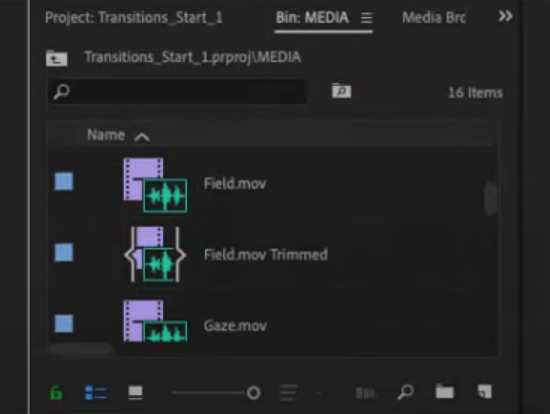

- \[ ] nel Browser multimediale, contrassegnare i punti di ingresso e stacco su una clip, quindi importare.
- \[ ] Contrassegnare i punti di ingresso e di stacco sulla clip nel monitor Programma e selezionare scegli Clip > Crea clip secondaria.
- \[ ] Contrassegnate i punti di ingresso e di stacco di una clip nel pannello Timeline, quindi trascinatela di nuovo in un raccoglitore.
- \[x] Contrassegnare i punti di ingresso e stacco della clip nel monitor Sorgente e selezionare Clip > Crea clip secondaria.

#### D16. Quale regolazione può aiutare a restituire i dettagli dei bordi alle riprese video?

- \[ ] Intensità
- \[ ] Contrasto
- \[x] Affilare
- \[ ] Chiarezza

#### D17. Dove è possibile regolare la durata di una transizione?

- \[ ] Pannello Effetti
- \[ ] Pannello Progetto
- \[x] Pannello Controllo effetti
- \[ ] Pannello Program Monitor

#### D18. Stai lavorando con un nuovo progetto e stai modificando da due ore. Qual è il numero di progetti di backup che ci si aspetterebbe di trovare?

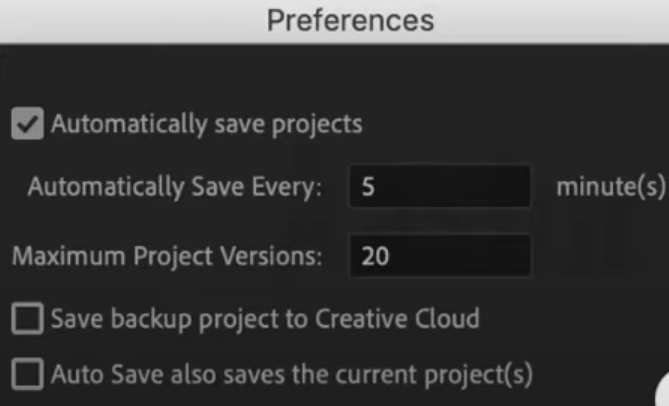

- \[ ] 2
- \[ ] 12
- \[x] 20
- \[ ] 24

#### D19. Quale pannello utilizzeresti per sfogliare e importare le risorse per la massima compatibilità con Premiere Pro?

- \[ ] Biblioteca
- \[ ] Effetti
- \[ ] Progetto
- \[x] Browser multimediale

Riferimento : https://helpx.adobe.com/in/premiere-pro/how-to/import-with-media-browser.html#:~:text=The%20Media%20Browser%20panel%20should,with%20fragmented%20media%20file%20types.\&text=To%20import%20selected%20clips%20into,on%20them%20and%20choose%20Import.

#### D20. Una transizione è impostata su allineato al centro. Quale sarebbe il risultato del trascinamento con lo strumento selezionato, a destra?

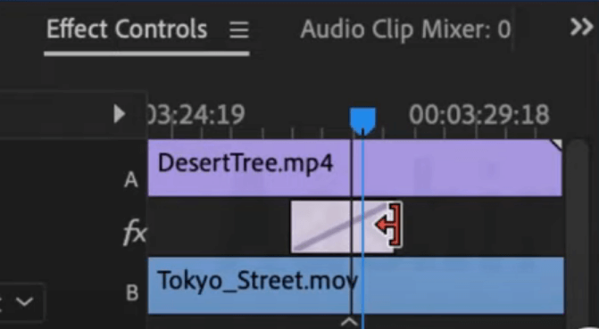

- \[x] La transizione scivolerebbe verso destra.
- \[ ] Estenderesti solo il lato destro della transizione.
- \[ ] Eseguirete un montaggio a catena ed estenderete la durata della prima clip.
- \[ ] La transizione crescerebbe da entrambe le parti.

#### D21. Quale applicazione NON supporta Dynamic Link?

- \[ ] Adobe Photoshop
- \[ ] Adobe Premiere Pro
- \[x] Adobe Audition
- \[ ] Adobe After Effects

#### D22. Quale riquadro delle preferenze include la durata predefinita della transizione video e la durata predefinita della transizione audio?

- \[ ] Media
- \[ ] Riproduzione
- \[ ] Generale
- \[x] Cronologia

#### D23. Se un effetto ha una stella accanto alla sua icona, che tipo di effetto è?

- \[ ] audio
- \[ ] modello
- \[ ] transizione
- \[x] preimpostato

#### D24. In che modo questa clip è stata manipolata utilizzando una regolazione Curve?

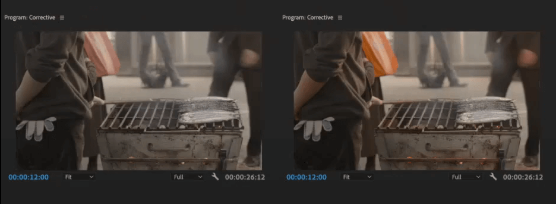

- \[x] Tonalità contro Luma
- \[ ] Saturazione vs. Saturazione
- \[ ] Tonalità vs. Saturazione
- \[ ] Luma vs. Saturazione

#### D25. Dove vengono archiviati i dati di trasparenza durante la composizione dei supporti?

- \[ ] Pannello Grafica essenziale
- \[x] Pannello Effetti
- \[ ] canale alfa
- \[ ] modifica assieme

#### D26. Quando una parte del metraggio è trasparente, dove vengono memorizzate le informazioni sulla trasparenza nel file?

- \[ ] monitor sorgente
- \[x] canale alfa
- \[ ] effetto opacità
- \[ ] effetto alfa

#### D27. Quale opzione consente di riutilizzare i file di rendering creati in precedenza per un'esportazione?

- \[x] Usa anteprime
- \[ ] Usa la fusione delle cornici
- \[ ] Usa la massima qualità di rendering
- \[ ] Impostazioni della sequenza di corrispondenza

#### D28. Nello scenario mostrato di seguito, desiderate estendere la fine della clip rossa nella timeline e non modificare la durata della clip adiacente. Qual è la scelta di assetto più appropriata per raggiungere questo obiettivo?

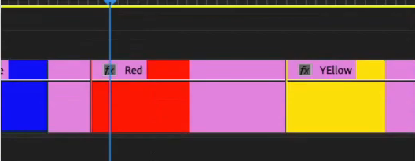

- \[ ] Trim In
- \[x] Ritaglia
- \[ ] Ripple Trim In
- \[ ] Ripple Trim Out

#### D29. Quali formati supporta Adobe Media Encoder? Selezionare tre elementi.

```markdown
A. GIF
B. DCP
C. QuickTime
D. HEVC
E. FLV
```

- \[ ] A, B, C
- \[ ] A, C, E
- \[x] B, C, D
- \[ ] B, D, E

#### D30. Quale formato di file video è possibile esportare con Adobe Media Encoder? Selezionare tre elementi.

```markdown
A. AVCHD
B. HEVC
C. Animated GIF
D. MXF OP1a
E. M4A
```

- \[ ] A, B, C
- \[ ] A, C, E
- \[ ] B, C, D
- \[x] B, D, E

#### D31. Se avete posizionato un effetto accelerato da GPU su una clip nella timeline e non ne avete eseguito il rendering, quale colore appare nella parte superiore della timeline?

- \[x] rosso
- \[ ] blu
- \[ ] giallo
- \[ ] verde

#### D32. Quale affermazione è vera per le preferenze Aspetto?

- \[ ] La luminosità predefinita è la posizione intermedia tra il più scuro e il più chiaro.
- \[ ] È possibile impostare la barra superiore delle finestre su un colore di accento personalizzato.
- \[ ] È possibile regolare l'intensità dell'indicatore di messa a fuoco per identificare facilmente quale finestra è attiva.
- \[x] È possibile modificare il colore di evidenziazione.

#### D33. Cosa puoi dire di questa transizione?

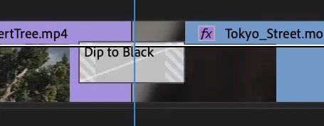

- \[ ] Premiere inserirà il bianco per riempire le maniglie necessarie.
- \[ ] Premiere inserirà il nero per riempire le maniglie necessarie.
- \[ ] Non ci sono abbastanza supporti (maniglie) per coprire la durata della transizione.
- \[ ] La transizione viene automaticamente accorciata per utilizzare solo i supporti disponibili e l'area sotto le linee diagonali non avrà transizioni applicate.

#### D34. Il progetto ha diverse sequenze che non sono più necessarie. Come utilizzeresti Project Manager per produrre una nuova versione del progetto che escluda le sequenze indesiderate?

- \[ ] Deselezionate le sequenze indesiderate nell'area Sequenza.
- \[ ] Selezionare Crea nuovo progetto tagliato.
- \[ ] Selezionare Consolida e transcodifica.
- \[x] Scegliere Raccogli file e Copia in una nuova posizione.

#### D35. Desiderate prendere una clip parziale utilizzata nella timeline e inviarla ad After Effects per un'ulteriore elaborazione utilizzando il collegamento dinamico. Quale metodo meglio realizza questo?

- \[ ] Selezionate la clip nella timeline e scegliete File > Adobe Dynamic Link > Importa After Effects Composition.
- \[ ] Selezionate la clip nella timeline e scegliete File > Adobe Dynamic Link > Sostituisci con After Effects Composition.
- \[ ] Selezionate la clip nella timeline e scegliete File > Adobe Dynamic Link > Nuova composizione after effects.
- \[ ] Selezionate la clip nella timeline e scegliete Modifica > Copia. Passate ad After Effects e scegliete Modifica > Incolla.

#### D36. Vuoi abbassare la saturazione solo nelle nuvole mostrate di seguito. Quale regolazione delle curve lo rende più semplice?

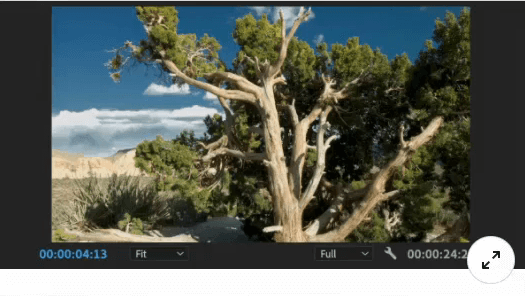

- \[ ] Tonalità vs. Saturazione
- \[ ] Curve RGB
- \[ ] Luma vs. Saturazione
- \[ ] Tonalità vs. Luma

#### D37. Qual è un nuovo tipo di livello grafico? Selezionare tre elementi.

```markdown
A. Logo
B. Text
C. Rectangle
D. Circle
E. Ellipse
```

- \[ ] A, B, C
- \[ ] A, C, E
- \[ ] B, C, E
- \[ ] B, D, E

#### D38. Quale opzione può creare un campo colore che regola automaticamente le dimensioni man mano che si aggiunge o si sottrae da un livello di testo?

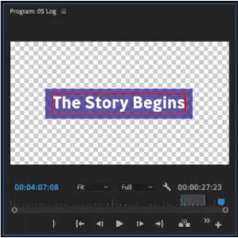

- \[ ] Selezionate Riempimento dai controlli Aspetto.
- \[ ] Selezionate Tratto (Stroke) dai controlli Aspetto (Appearance).
- \[ ] Scegliere Sfondo dai controlli Aspetto.
- \[ ] Scegliete Ombra dai controlli Aspetto.

#### D39. Se vuoi schiarire solo le aree più scure di un'immagine, quale cursore dovresti regolare nell'effetto Lumetri?

- \[ ] Ombre
- \[ ] Contrasto
- \[ ] Mezzitoni
- \[ ] Neri

#### D40. Guardando l'istogramma qui sotto, quale singolo cursore di regolazione potrebbe creare questa modifica?

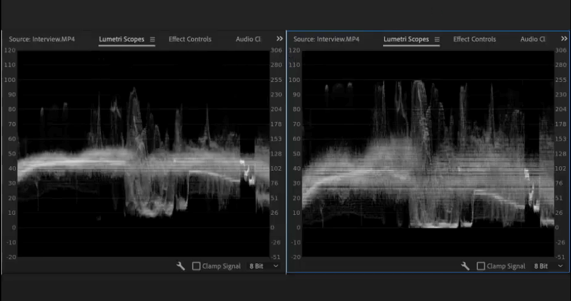

- \[ ] Neri
- \[x] Contrasto
- \[ ] Bianchi
- \[ ] Esposizione

#### D41. In quale menu a discesa è possibile rimuovere gli effetti?

- \[ ] Sequenza
- \[ ] File
- \[ ] Modifica
- \[ ] Clip

#### D42. Quale regolazione è possibile utilizzare per convertire rapidamente i filmati di registro utilizzando le impostazioni consigliate da un produttore della fotocamera?

- \[ ] Aspetto creativo
- \[ ] Film sbiadito
- \[ ] LUT di ingresso
- \[ ] Intensità

#### D43. Quale modalità di automazione del mixer audio consente a un'automazione di tornare allo stato precedente dopo aver apportato eventuali regolazioni?

- \[ ] Tocca
- \[ ] Chiusura
- \[ ] Scrivi
- \[ ] Leggi

#### D44. Desiderate che Premiere Pro crei una seconda istanza dei file multimediali e aggiunga una versione aggiuntiva a una bozza di risoluzione. Quale opzione funziona meglio nelle impostazioni di acquisizione?

- \[ ] Transcodifica
- \[ ] Copia e crea proxy
- \[ ] Crea proxy
- \[ ] Copia

#### D45. Se sono state importate diverse sequenze time-lapse nel progetto come sequenze di immagini, quale opzione in Project Manager è più utile per archiviare il progetto?

- \[ ] Converti sequenze di immagini in clip
- \[ ] Converti le composizioni After Effects in clip
- \[ ] Includi file di anteprima
- \[ ] Consolida e transcodifica

#### D46. Quale opzione è abilitata per influire sulla visualizzazione delle forme d'onda audio come mostrato di seguito?

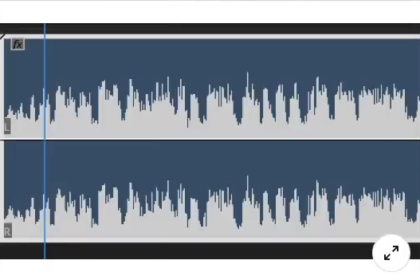

- \[ ] Mostra unità di tempo audio
- \[ ] Forma d'onda audio rettificata
- \[ ] Grandi forme d'onda audio
- \[ ] Ridimensionamento logaritmico dei fotogrammi chiave

#### D47. Desiderate spostare il pannello Cronologia in modo indipendente per posizionarlo su un altro monitor come finestra mobile. Quale opzione nel sottomenu del pannello dovresti selezionare?

- \[ ] Pannello Di sgancio
- \[ ] Sgancia telaio
- \[ ] Massimizza pannello
- \[ ] Massimizza fotogramma

#### D48. Per disporre rapidamente i pannelli in Adobe Premiere Pro per un'attività specifica, cosa utilizzate?

- \[x] aree di lavoro
- \[ ] layout
- \[ ] preimpostazioni del pannello
- \[ ] eventi
